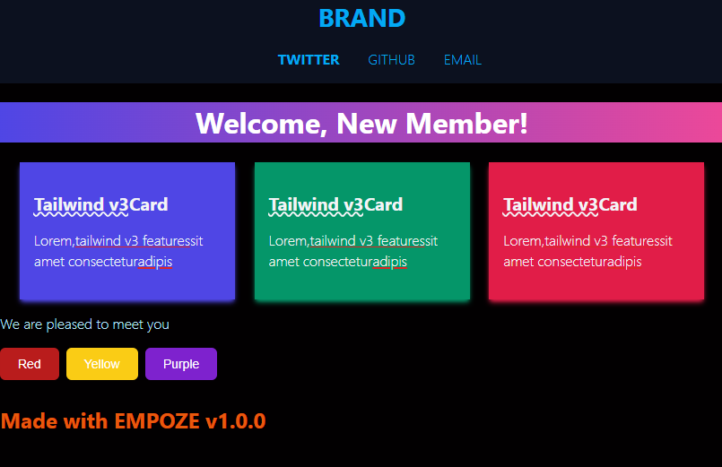

# 📨Empoze
 Compose responsive emails with React & Tailwind! Create single HTML string from your react components.


Currently bundled for usage through NodeJS server (not web).

*basic demo image (to be updated)*:


This project takes react components, then:
- determines tailwind class usage
- converts tailwind class to inline CSS
- determines included css files
- includes included css as ```style``` tags

The end result is: Tailwind CSS V3 classes + Custom external CSS + React Components (use them as you normally would: nesting, props, etc). All outputted to a programmatic HTML string (which currently is output to a .html file in deploy folder).

Uses react, tailwindcss v3, juice, babel, webpack, mailwind.


Readme to be updated shortly.